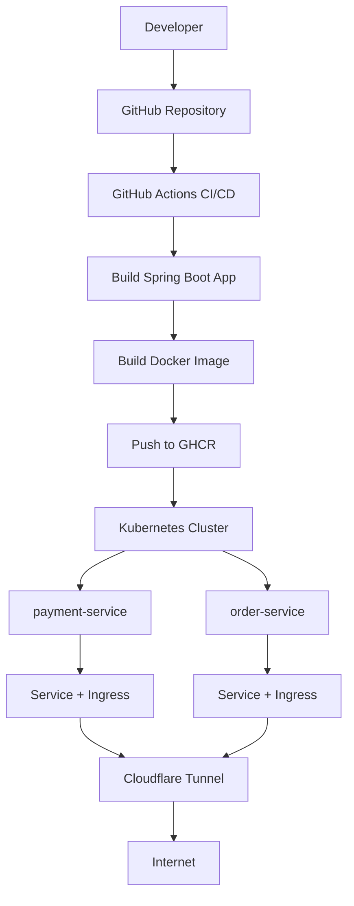

# 🚀 Developer Platform (IDP)


Internal Developer Platform (IDP) focused on automating the provisioning, CI/CD pipeline, and Kubernetes deployment of Spring Boot services.

---

# 📌 Overview

This project was created to accelerate backend service creation and standardize deployment workflows using modern platform engineering practices.

The platform automates:

* Spring Boot service generation
* CI/CD pipeline execution
* Docker image build and push
* Kubernetes deployment
* Rollout validation
* Automatic rollback on failure

---

# 🧠 Architecture

```text
Developer
   ↓
Git Push
   ↓
GitHub Actions (CI/CD)
   ↓
Docker Build
   ↓
GitHub Container Registry (GHCR)
   ↓
Kubernetes Cluster (Minikube)
   ↓
┌───────────────────────┐
│   payment-service     │
│   order-service       │
└───────────────────────┘
   ↓
Services + Ingress
   ↓
Cloudflare Tunnel
   ↓
Internet 🌍
```

---

## 🧠 Platform Architecture



---

# 🎥 Demo

## CI/CD Pipeline

## Kubernetes Deployment

## Backstage Template

---

# ⚙️ Technologies

* Java 21
* Spring Boot
* Docker
* Kubernetes (Minikube)
* GitHub Actions
* GitHub Container Registry (GHCR)
* Cloudflare Tunnel
* Backstage
* GitOps concepts

---

# 🔄 CI/CD Pipeline

The pipeline automatically performs:

1. Maven build
2. Docker image build
3. Docker push to GHCR
4. Kubernetes deployment
5. Rollout validation
6. Automatic rollback on failure

---

# 🛡️ Reliability Features

## Readiness Probe

Ensures traffic is routed only to healthy containers.

## Liveness Probe

Automatically restarts unhealthy containers.

## Automatic Rollback

If deployment validation fails, Kubernetes automatically rolls back to the previous version.

---

# 🚀 Running the Environment

## Start Kubernetes

```bash id="pcjlwm"
minikube start
```

---

## Start GitHub Runner

```bash id="qdjlwm"
cd ~/platform/runners/github/actions-runner
./run.sh
```

---

## Expose Application Locally

```bash id="jlwmes"
kubectl port-forward deployment/payment-service 8080:8080
```

---

## Expose Publicly via Cloudflare

```bash id="jlwmfs"
cloudflared tunnel --url http://127.0.0.1:8080
```

---

# 🧪 Health Check

```bash id="jlwmgs"
curl http://localhost:8080/health
```

Expected response:

```text id="jlwmhs"
service running
```

---

# 💡 Key Features

* Automated CI/CD
* Kubernetes deployment automation
* Versioned deployments using commit SHA
* Rollout validation
* Automatic rollback
* Internal Developer Platform foundation
* Infrastructure standardization

---

# 🧩 Multi-Service Architecture

The platform now supports multiple services running simultaneously inside the same Kubernetes cluster.

Current services:

- payment-service
- order-service

Each service contains its own:

- Kubernetes Deployment
- Kubernetes Service
- Ingress configuration
- CI/CD pipeline
- Rollback strategy

This architecture enables scalability, service isolation, and future expansion into a real microservices platform.

---

# 🎯 Future Improvements

* Shared GitHub Runner
* Kubernetes namespaces
* AWS EKS deployment
* Prometheus + Grafana observability
* Canary deployments
* Blue/Green strategy
* Dynamic service templates
* Shared cluster ingress controller
* Service discovery
* API Gateway

---

# 👨‍💻 Author

Marcel Philippe Andrade
