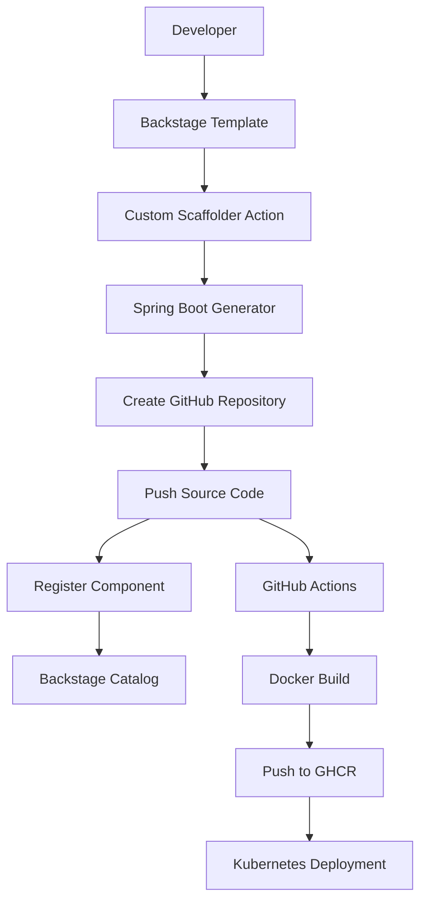

# 🚀 Internal Developer Platform (IDP)


Internal Developer Platform (IDP) built with Backstage, Kubernetes, GitHub Actions and Spring Boot templates to automate service provisioning, software delivery and platform operations.

---

# 📌 Overview

This project was created to explore Platform Engineering concepts and build a complete Internal Developer Platform capable of provisioning, deploying and managing backend services with minimal manual intervention.

The platform automates:

* Spring Boot service generation
* GitHub repository creation
* Source code publishing
* Service registration in Backstage Catalog
* CI/CD execution
* Docker image build and push
* Kubernetes deployment
* Rollout validation
* Automatic rollback

---

# 🏗️ Platform Architecture

```text
Developer
   │
   ▼
Backstage Portal
   │
   ▼
Software Template
   │
   ▼
Custom Scaffolder Action
   │
   ▼
Spring Boot Generator
   │
   ▼
GitHub Repository Creation
   │
   ▼
Source Code Push
   │
   ▼
Catalog Registration
   │
   ▼
GitHub Actions
   │
   ▼
Docker Build
   │
   ▼
GHCR
   │
   ▼
Kubernetes Cluster
```

---

# 🧠 Provisioning Workflow



---

# 🧩 Backstage Features

The platform currently supports:

* Software Templates
* Custom Scaffolder Actions
* Spring Boot Service Generation
* Workspace-based Scaffolder Execution
* Automatic GitHub Repository Creation
* Automatic Source Code Push
* Automatic Catalog Registration
* Service Discovery through Catalog

---

# ⚙️ Technologies

* Backstage
* TypeScript
* Node.js
* Python
* Bash
* Java 21
* Spring Boot 3
* Maven
* Docker
* GitHub Actions
* GitHub Container Registry (GHCR)
* Kubernetes (Minikube)

---

# 🔄 Automated Provisioning Flow

When a developer creates a new service through Backstage:

1. Fill template parameters
2. Generate Spring Boot project
3. Create GitHub repository
4. Push generated source code
5. Register component in Catalog
6. Trigger CI/CD pipeline
7. Deploy to Kubernetes

No manual repository creation or Catalog registration is required.

---

# 🔄 CI/CD Pipeline

The pipeline automatically performs:

1. Maven Build
2. Unit Tests
3. Docker Build
4. Docker Push
5. Kubernetes Deployment
6. Rollout Validation
7. Automatic Rollback

---

# 🛡️ Reliability Features

## Readiness Probe

Ensures traffic is routed only to healthy containers.

## Liveness Probe

Automatically restarts unhealthy containers.

## Automatic Rollback

If deployment validation fails, Kubernetes automatically rolls back to the previous version.

---

# 🚀 Running the Environment

## Start Kubernetes

```bash
minikube start
```

## Start GitHub Runner

```bash
cd ~/platform/runners/github/actions-runner
./run.sh
```

## Start Backstage

```bash
cd ~/platform/backstage/developer-portal
yarn dev
```

## Start Generator API

```bash
cd ~/platform/generators
uvicorn main:app --reload --port 8000
```

---

# 🧪 Creating a New Service

1. Open Backstage
2. Create Component
3. Select Spring Boot Template
4. Fill service parameters
5. Submit template

The platform automatically:

* Generates source code
* Creates GitHub repository
* Pushes code
* Registers the component in Catalog

---

# 💡 Current Capabilities

* Self-Service Developer Portal
* Automated Service Provisioning
* GitHub Integration
* Service Catalog
* Kubernetes Deployments
* CI/CD Automation
* Platform Standardization

---

# 🎯 Next Steps

## Phase 2 — Platform Engineering

Planned improvements:

* Template versioning
* Multiple service templates
* Golden Paths
* Kubernetes namespaces
* Service ownership model
* Prometheus integration
* Grafana dashboards
* ArgoCD GitOps
* AWS EKS deployment
* Developer Scorecards
* Platform Metrics

---

# 👨‍💻 Author

Marcel Philippe Andrade

Platform Engineering Lab Project
